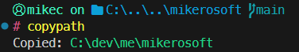

#  copypath

Copy the full path of a file or folder from the terminal

Windows · macOS

<!-- media: hero -->
<!--  -->
<!-- /media: hero -->

## What it is

Tiny one, this. Run `copypath` and the absolute path of where you are goes on your clipboard, or give it a file or folder and it copies that instead.

It copes with relative paths and even paths that don't exist yet.

## Get it

Paste this into your AI coding agent (Claude Code, Codex, Cursor...):

> Clone https://github.com/mikecann/copypath and make it my own. It's one of Mike
> Cann's personal tools, so read the README first, change anything specific to his
> setup to suit mine, then help me get it running.

### Or set it up by hand

You'll need Git to clone it. No API keys or `.env` file needed.

```sh
git clone https://github.com/mikecann/copypath
cd copypath
```

On Windows, use Windows PowerShell 5.1 or later. Run this from the clone:

```powershell
powershell -NoProfile -ExecutionPolicy Bypass -File .\install.ps1
```

I use `C:\dev\tools` for the generated batch and Git Bash launchers. Add that folder to your user PATH in Windows Environment Variables, then open a new terminal. To pick another folder, pass `-ToolsDir C:\your\bin`. Keep the clone at a path without non-ASCII characters because the batch launcher is ASCII.

On macOS, you'll need Python 3 on PATH and the built-in `pbcopy` command:

```sh
bash install.sh
```

This links `copypath` into `~/.local/bin`. If that folder isn't on PATH, add `export PATH="$HOME/.local/bin:$PATH"` to `~/.zshrc` and open a new terminal. You can also pass another directory, such as `bash install.sh /path/to/bin`.

Keep the clone in place after installing. The launchers point at it, so updates work with `git pull`. Re-run the installer if you move the clone.

## Using it

```powershell
copypath                     # copy the current directory
copypath .\README.md          # copy a relative file path
copypath "C:\some folder"     # copy an absolute path with spaces
copypath .\not-created-yet    # copy a path that doesn't exist yet
```

On macOS the same command uses `/` paths:

```sh
copypath
copypath ./README.md
copypath "/Users/me/some folder"
```

The Windows script also handles PowerShell provider paths. The macOS launcher normalizes filesystem paths, without resolving symbolic links. Both print `Copied:` followed by the path.



## Uninstalling

On Windows, run `powershell -NoProfile -ExecutionPolicy Bypass -File .\uninstall.ps1`, using the same `-ToolsDir` if you chose a custom folder. It removes the launchers that still match this clone and leaves other tools and PATH alone.

On macOS, remove the symlink with `rm ~/.local/bin/copypath`, or remove it from the custom directory you installed into.

## Development

There's no build step. Run the scripts directly or use the installed command.

```sh
pwsh -NoProfile -File tests/run-tests.ps1
python3 -m unittest discover -s tests -v
bash -n copypath install.sh
```

The tests run the real scripts with a mocked clipboard writer and temporary install directories. CI checks PowerShell parsing and tests on Windows, plus shell syntax and launcher tests on macOS. Actual Windows clipboard and terminal integration still need a Windows smoke test.

## More tools

You can find my other tools at [mikerosoft.app](https://mikerosoft.app).

MIT licensed.
